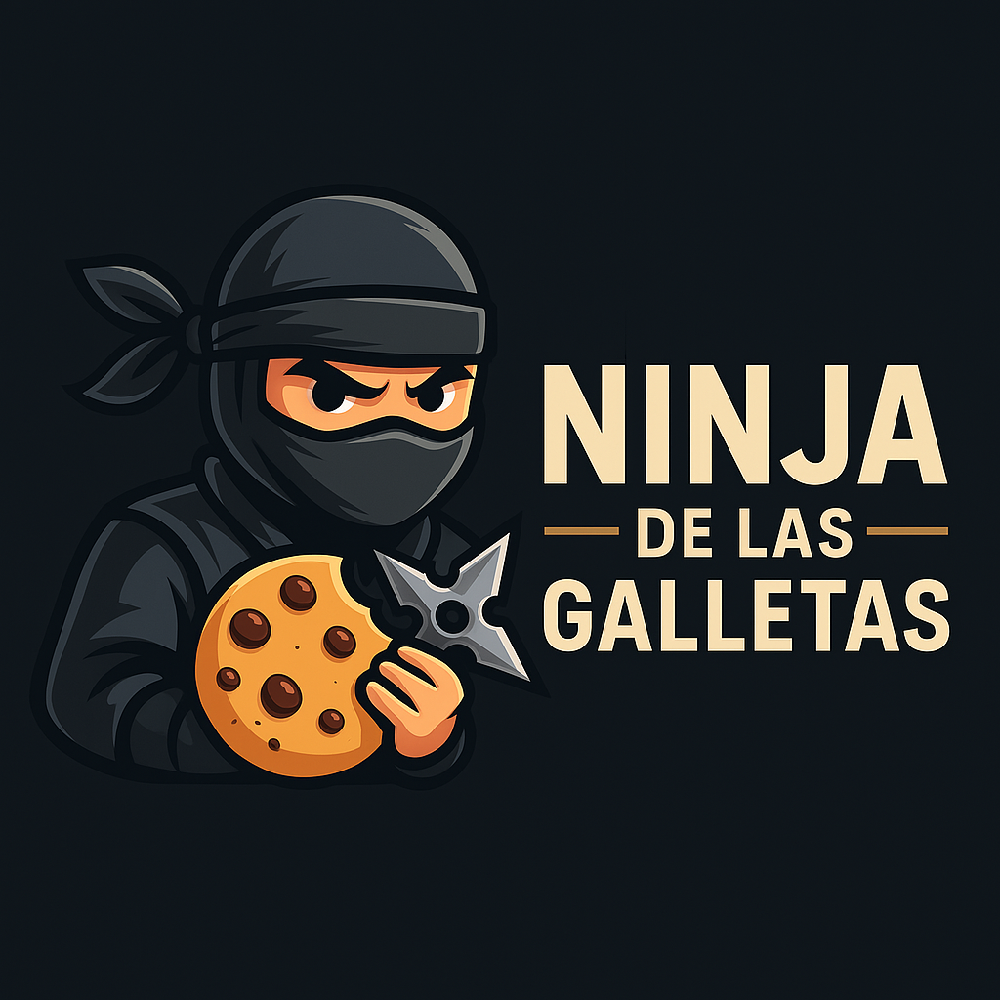

📄 README.md — Ninja de las Galletas 🍪🥷

`md

Ninja de las Galletas 🍪⚔️

Audita, clasifica y automatiza el manejo de cookies y CAPTCHA en sitios protegidos.  
Una suite para evasión inteligente, análisis OSINT y optimización web con precisión ninja.

---

🧠 Funcionalidades principales

| Módulo                    | Descripción breve                                      |
|--------------------------|--------------------------------------------------------|
| cookie_classifier.py   | Clasifica cookies en función de seguridad y utilidad   |
| cloudflare_bypass.py   | Elude protecciones Cloudflare automáticamente          |
| captcha_solver.py      | Integra API externa para resolver CAPTCHA              |
| cookie_importer.py     | Importa cookies desde archivos JSON o navegador        |
| ninja_interface.html   | Interfaz web sencilla para manejar los módulos         |

---

⚙️ Instalación rápida

`bash
git clone https://github.com/Edwin041093/ninja-de-las-galletas.git
cd ninja-de-las-galletas
pip install -r requirements.txt
python server.py
`

Accede desde tu navegador en http://localhost:5000

---

🧭 Uso recomendado

1. Sube tu archivo de cookies en formato .json
2. Clasifícalas por tipo y utilidad
3. Ejecuta el módulo de evasión para bypass automático
4. Integra CAPTCHA Solver si el sitio lo requiere

---

🎯 Aplicaciones

- Web scraping profesional
- Auditorías OSINT
- Pruebas de penetración en entornos protegidos
- Automatización para workflows de investigación

---

🤝 Contribuciones

¿Ideas, mejoras o módulos nuevos?  
Haz un fork, abre un Pull Request o contáctame directamente.  
¡La comunidad ninja está en expansión!

---

📜 Licencia

Este proyecto está bajo la licencia MIT.  
Úsalo, modifícalo, y mejora tu flujo de trabajo sin restricciones.

---
